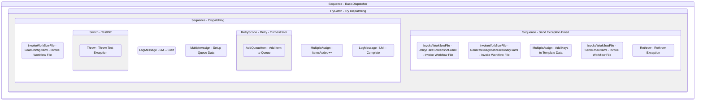

# BasicDispatcher
Class: BasicDispatcher

Reads data from the srouce of work and adds it to a queue.

## Workflow Details

    

    <b>Namespaces</b>
    

    
- GlobalConstantsNamespace
- GlobalVariablesNamespace
- System
- System.Activities
- System.Activities.Runtime.Collections
- System.Activities.Statements
- System.Collections
- System.Collections.Generic
- System.Collections.ObjectModel
- System.Linq
- System.Reflection
- System.Runtime.Serialization
- UiPath.Core
- UiPath.Core.Activities

    

    <b>References</b>
    

- Microsoft.CSharp
- Microsoft.VisualBasic
- Microsoft.Win32.Primitives
- NPOI
- PresentationFramework
- System
- System.Activities
- System.Collections
- System.ComponentModel
- System.ComponentModel.EventBasedAsync
- System.ComponentModel.Primitives
- System.ComponentModel.TypeConverter
- System.Configuration.ConfigurationManager
- System.Console
- System.Core
- System.Data
- System.Data.Common
- System.Data.SqlClient
- System.Linq
- System.Memory
- System.Memory.Data
- System.ObjectModel
- System.Private.CoreLib
- System.Private.DataContractSerialization
- System.Private.ServiceModel
- System.Private.Uri
- System.Private.Xml
- System.Reflection.DispatchProxy
- System.Reflection.Metadata
- System.Reflection.TypeExtensions
- System.Runtime.Serialization
- System.Runtime.Serialization.Formatters
- System.Runtime.Serialization.Primitives
- System.Security.Permissions
- System.ServiceModel
- System.ServiceModel.Activities
- System.Xaml
- System.Xml
- System.Xml.Linq
- UiPath.Studio.Constants
- UiPath.System.Activities
- UiPath.System.Activities.Design
- UiPath.System.Activities.ViewModels
- UiPath.Workflow
- WindowsBase

    

    <b>Arguments</b>
    

| Name | Direction | Type | Description |
|  --- | --- | --- | ---  |
| in_ConfigPath | InArgument | x:String | The path to the config file to use to load variables and resources. |
| in_IgnoreSheets | InArgument | s:String[] | A list of the sheets to ignore loading from the config. |
| in_TestID | InArgument | x:String | Used to modify the workflow in order to test different scenarios. Only used to test exception handling in this workflow. Leave as null for production use. |

    

    

    <b>Workflows Used</b>
    

- C:\Users\eyash\Documents\UiPath\LazyFramework\Utility\LoadConfig.xaml
- C:\Users\eyash\Documents\UiPath\LazyFramework\Utility\TakeScreenshot.xaml
- C:\Users\eyash\Documents\UiPath\LazyFramework\Utility\GenerateDiagnosticDictionary.xaml
- C:\Users\eyash\Documents\UiPath\LazyFramework\Utility\SendEmail.xaml

    

    

    <b>Tests</b>
    

    

## Outline (Beta)

