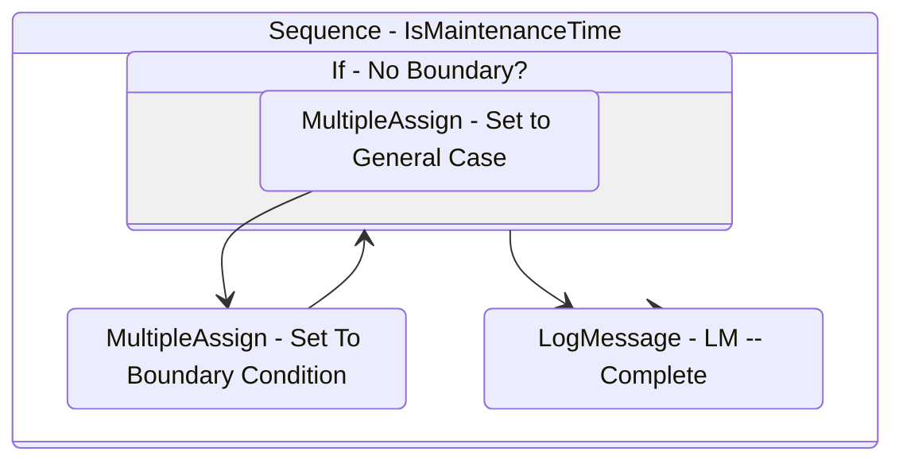

# IsMaintenanceTime
Class: IsMaintenanceTime

Given a CRON expression for the maintenance schedule, checks whether the current date/time is within the maintenance window. Outputs a boolean.

## Workflow Details

    

    <b>Namespaces</b>
    

    - GlobalConstantsNamespace
- GlobalVariablesNamespace
- System
- System.Activities
- System.Activities.Statements
- System.Collections
- System.Collections.Generic
- System.Collections.ObjectModel
- System.Linq
- UiPath.Core
- UiPath.Core.Activities

    

    <b>References</b>
    

    - Microsoft.CSharp
- Microsoft.VisualBasic
- NPOI
- System
- System.Activities
- System.ComponentModel
- System.ComponentModel.TypeConverter
- System.Configuration.ConfigurationManager
- System.Console
- System.Core
- System.Data
- System.Data.Common
- System.Linq
- System.Linq.Expressions
- System.Memory
- System.Memory.Data
- System.ObjectModel
- System.Private.CoreLib
- System.Private.Uri
- System.Reflection.DispatchProxy
- System.Reflection.Metadata
- System.Reflection.TypeExtensions
- System.Runtime.Serialization
- System.Security.Permissions
- System.ServiceModel
- System.ServiceModel.Activities
- System.Xaml
- System.Xml
- System.Xml.Linq
- UiPath.Studio.Constants
- UiPath.System.Activities
- UiPath.Workflow

    

    <b>Arguments</b>
    

    <table><tr><th>Name</th><th>Direction</th><th>Type</th><th>Description</th></tr><tr><td>in_Start</td><td>InArgument</td><td>x:TimeSpan</td><td>The start time of the maintenance period.</td></tr><tr><td>in_End</td><td>InArgument</td><td>x:TimeSpan</td><td>The end time of the maintenance period.</td></tr><tr><td>out_IsMaintenanceTime</td><td>OutArgument</td><td>x:Boolean</td><td>Output boolean as to whether current time is within the maintenance period.</td></tr></table>
    

## Outline (Beta)

