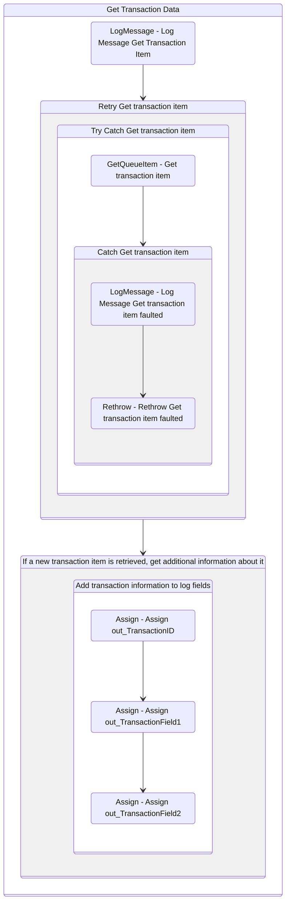

# GetTransactionData
Class: GetTransactionData

Get a transaction item from a specified source (e.g., Orchestrator queues, spreadsheets, databases, mailboxes or web APIs). 

If there are no transaction items remaining, out_TransactionItem is set to Nothing, which leads to the End Process state. 

For cases in which there is only a single transaction (i.e., a linear process), use an If activity to check whether the argument in_TransactionNumber has the value 1 (meaning it is the first and only transaction) and assign the transaction item to out_TransactionItem. For any other value of in_TransactionNumber, out_TransactionItem should be set to Nothing.

If there are multiple transactions, use the argument in_TransactionNumber as an index to retrieve the correct transaction to be processed. If there are no more transactions left, it is necessary to set out_TransactionItem to Nothing, thus ending the process.

## Workflow Details

    

    <b>Namespaces</b>
    

    - System
- System.Activities
- System.Activities.DynamicUpdate
- System.Activities.Statements
- System.Collections
- System.Collections.Generic
- System.Collections.ObjectModel
- System.Data
- System.Linq
- System.Linq.Expressions
- System.Runtime.Serialization
- System.Text
- UiPath.Core
- UiPath.Core.Activities

    

    <b>References</b>
    

    - Microsoft.CSharp
- System
- System.Activities
- System.ComponentModel
- System.ComponentModel.Composition
- System.ComponentModel.Primitives
- System.ComponentModel.TypeConverter
- System.Core
- System.Data
- System.Data.Common
- System.Linq
- System.ObjectModel
- System.Private.CoreLib
- System.Private.Xml
- System.Runtime.Serialization
- System.ServiceModel
- System.ServiceModel.Activities
- System.ValueTuple
- System.Xaml
- System.Xml
- System.Xml.Linq
- UiPath.Excel
- UiPath.System.Activities
- UiPath.System.Activities.Design

    

    <b>Arguments</b>
    

    <table><tr><th>Name</th><th>Direction</th><th>Type</th><th>Description</th></tr><tr><td>in_TransactionNumber</td><td>InArgument</td><td>x:Int32</td><td>Sequential counter of transaction items.</td></tr><tr><td>in_Config</td><td>InArgument</td><td>scg:Dictionary<x:String, x:Object></td><td>Dictionary structure to store configuration data of the process (settings, constants and assets).</td></tr><tr><td>out_TransactionItem</td><td>OutArgument</td><td>ui:QueueItem</td><td>Transaction item to be processed.</td></tr><tr><td>out_TransactionField1</td><td>OutArgument</td><td>x:String</td><td>Allow the optional addition of information about the transaction item.</td></tr><tr><td>out_TransactionField2</td><td>OutArgument</td><td>x:String</td><td>Allow the optional addition of information about the transaction item.</td></tr><tr><td>out_TransactionID</td><td>OutArgument</td><td>x:String</td><td>Transaction ID used for information and logging purposes. Ideally, the ID should be unique for each transaction. </td></tr><tr><td>io_dt_TransactionData</td><td>InOutArgument</td><td>sd:DataTable</td><td>This variable can be used in case transactions are stored in a DataTable (for example, after being retrieved from a spreadsheet).</td></tr></table>
    

## Outline (Beta)

