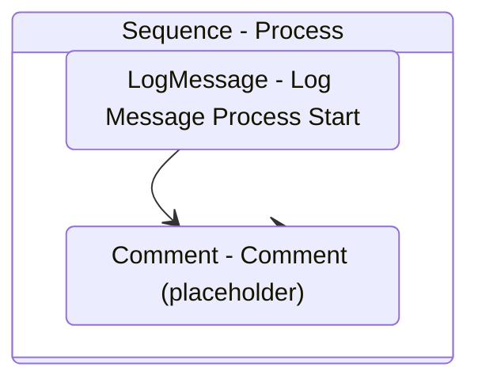

# Process
Class: Process

Invoke major steps of the business process, which are usually implemented by multiple subworkflows.

If a BusinessRuleException is thrown, the transaction is skipped. 
If another kind of exception occurs, the current transaction can be retried. 

## Workflow Details

    

    <b>Namespaces</b>
    

    - System
- System.Collections.Generic
- System.Data
- System.Linq
- System.Text
- UiPath.Core
- UiPath.Core.Activities
- System.Activities
- System.Activities.Statements
- System.Activities.DynamicUpdate
- System.Runtime.Serialization
- System.Runtime.InteropServices
- System.Linq.Expressions
- System.Collections.ObjectModel

    

    <b>References</b>
    

    - Microsoft.Bcl.AsyncInterfaces
- Microsoft.CSharp
- System
- System.Activities
- System.ComponentModel.Composition
- System.ComponentModel.TypeConverter
- System.Core
- System.Data
- System.Data.Common
- System.Linq
- System.Memory
- System.ObjectModel
- System.Private.CoreLib
- System.Runtime.Serialization
- System.ServiceModel
- System.ServiceModel.Activities
- System.ValueTuple
- System.Xaml
- System.Xml
- System.Xml.Linq
- UiPath.Excel
- UiPath.System.Activities

    

    <b>Arguments</b>
    

    <table><tr><th>Name</th><th>Direction</th><th>Type</th><th>Description</th></tr><tr><td>in_TransactionItem</td><td>InArgument</td><td>ui:QueueItem</td><td>Transaction item to be processed.</td></tr><tr><td>in_Config</td><td>InArgument</td><td>scg:Dictionary(x:String, x:Object)</td><td>Dictionary structure to store configuration data of the process (settings, constants and assets).</td></tr></table>
    

    

    <b>Workflows Used</b>
    

    

    

    

    <b>Tests</b>
    

    

    

## Outline (Beta)

