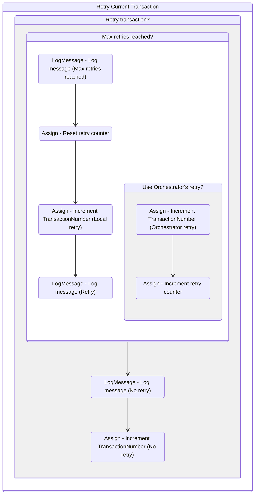

# {WorkflowName}
Class: RetryCurrentTransaction

Manage the retrying mechanism for the framework and it is invoked in SetTransactionStatus.xaml when a system exception occurs. 
The retrying method is based on the configurations defined in Config.xlsx.

## Workflow Details

    

    <b>Namespaces</b>
    

    - System
- System.Collections.Generic
- System.Data
- System.Linq
- System.Text
- UiPath.Core
- UiPath.Core.Activities
- System.Linq.Expressions
- System.Collections.ObjectModel

    

    <b>References</b>
    

    - Microsoft.CSharp
- System
- System.Activities
- System.ComponentModel.TypeConverter
- System.Core
- System.Data
- System.Data.Common
- System.Linq
- System.ObjectModel
- System.Private.CoreLib
- System.Runtime.Serialization
- System.ServiceModel
- System.ServiceModel.Activities
- System.ValueTuple
- System.Xaml
- System.Xml
- System.Xml.Linq
- UiPath.Excel
- UiPath.System.Activities
- UiPath.System.Activities.Design

    

    <b>Arguments</b>
    

    <table><tr><th>Name</th><th>Direction</th><th>Type</th><th>Description</th></tr><tr><td>in_Config</td><td>InArgument</td><td>scg:Dictionary<x:String, x:Object></td><td>Dictionary structure to store configuration data of the process (settings, constants and assets).</td></tr><tr><td>io_RetryNumber</td><td>InOutArgument</td><td>x:Int32</td><td>Used to control the number of attempts of retrying the transaction processing in case of system exceptions.</td></tr><tr><td>io_TransactionNumber</td><td>InOutArgument</td><td>x:Int32</td><td>Sequential counter of transaction items.</td></tr><tr><td>in_SystemException</td><td>InArgument</td><td>s:Exception</td><td>Used during transitions between states to represent exceptions other than business exceptions.</td></tr><tr><td>in_QueueRetry</td><td>InArgument</td><td>x:Boolean</td><td>Used to indicate whether the retry procedure is managed by an Orchestrator queue.</td></tr></table>

## Outline (Beta)

