# SetTransactionStatus
Class: SetTransactionStatus

Set and log the transaction's status along with extra log fields. 
There can be three possible statuses: Success, Business Exception and System Exception.

Business Rule Exception characterizes an irregular situation according to the process's rules and prevents the transaction to be processed. The transaction is not retried in this case, since the result will be the same until the problem that causes the exception is solved.
For example, it can be considered a BusinessRuleException if a process expects to read an email's attachment, but the sender didn't attach any file. In this case, immediate retries of the transaction will not yield a different result.

On the other hand, system exceptions are characterized by exceptions whose types are different than BusinessRuleException. When this kind of exception happens, the transaction item can be retried after closing and reopening the applications involved in the process. The rationale behind this is that the exception was caused by a problem in the applications, which might be solved by restarting them.

If Orchestrator queues are the source of transactions, the Set Transaction Status activity is used to update the status. In addition, the retry mechanism is also implemented by Orchestrator.

If Orchestrator queues are not used, the status can be set, for example, by writing to a specific column in a spreadsheet. In such cases, the retry mechanism is covered by the framework and the number of retries is defined in the configuration file.

At the end, io_TransactionNumber is incremented, which makes the framework get the next transaction to be processed.

## Workflow Details

    

    <b>Namespaces</b>
    

    - GlobalConstantsNamespace
- GlobalVariablesNamespace
- System
- System.Activities
- System.Activities.DynamicUpdate
- System.Activities.Statements
- System.Collections
- System.Collections.Generic
- System.Collections.ObjectModel
- System.Data
- System.Linq
- System.Linq.Expressions
- System.Reflection
- System.Runtime.InteropServices
- System.Runtime.Serialization
- System.Text
- UiPath.Core
- UiPath.Core.Activities

    

    <b>References</b>
    

    - Microsoft.Bcl.AsyncInterfaces
- Microsoft.CSharp
- NPOI
- System
- System.Activities
- System.Collections
- System.ComponentModel
- System.ComponentModel.Composition
- System.ComponentModel.TypeConverter
- System.Configuration.ConfigurationManager
- System.Console
- System.Core
- System.Data
- System.Data.Common
- System.Linq
- System.Linq.Expressions
- System.Memory
- System.Memory.Data
- System.ObjectModel
- System.Private.CoreLib
- System.Private.ServiceModel
- System.Private.Uri
- System.Runtime.Serialization
- System.Security.Permissions
- System.ServiceModel
- System.ServiceModel.Activities
- System.ValueTuple
- System.Xaml
- System.Xml
- System.Xml.Linq
- UiPath.Excel
- UiPath.Studio.Constants
- UiPath.System.Activities
- UiPath.System.Activities.Design
- UiPath.Workflow

    

    <b>Arguments</b>
    

    <table><tr><th>Name</th><th>Direction</th><th>Type</th><th>Description</th></tr><tr><td>in_BusinessException</td><td>InArgument</td><td>ui:BusinessRuleException</td><td>Exception variable that is used during transitions between states and represents a situation that does not conform to the rules of the process being automated.</td></tr><tr><td>in_Config</td><td>InArgument</td><td>scg:Dictionary(x:String, x:Object)</td><td>Dictionary structure to store configuration data of the process (settings, constants and assets).</td></tr><tr><td>in_TransactionItem</td><td>InArgument</td><td>ui:QueueItem</td><td>Transaction item to be processed.</td></tr><tr><td>io_RetryNumber</td><td>InOutArgument</td><td>x:Int32</td><td>Used to control the number of attempts of retrying the transaction processing in case of system exceptions.</td></tr><tr><td>io_TransactionNumber</td><td>InOutArgument</td><td>x:Int32</td><td>Sequential counter of transaction items.</td></tr><tr><td>in_TransactionField1</td><td>InArgument</td><td>x:String</td><td>Optionally used to include additional information about the transaction item.</td></tr><tr><td>in_TransactionField2</td><td>InArgument</td><td>x:String</td><td>Optionally used to include additional information about the transaction item.</td></tr><tr><td>in_TransactionID</td><td>InArgument</td><td>x:String</td><td>Used for information and logging purposes. Ideally, the ID should be unique for each transaction. </td></tr><tr><td>in_SystemException</td><td>InArgument</td><td>s:Exception</td><td>Used during transitions between states to represent exceptions other than business exceptions.</td></tr><tr><td>io_ConsecutiveSystemExceptions</td><td>InOutArgument</td><td>x:Int32</td><td>Used to control the number of consecutive system exceptions.</td></tr></table>
    

    

    <b>Workflows Used</b>
    

    - C:\Users\eyash\Documents\UiPath\LazyFramework\Utility\TakeScreenshot.xaml
- C:\Users\eyash\Documents\UiPath\LazyFramework\.templates\Performers\REFramework\Framework\RetryCurrentTransaction.xaml
- C:\Users\eyash\Documents\UiPath\LazyFramework\.templates\Performers\REFramework\Framework\CloseAllApplications.xaml
- C:\Users\eyash\Documents\UiPath\LazyFramework\Framework\KillAllProcesses.xaml

    

    

    <b>Tests</b>
    

    

    

## Outline (Beta)

```mermaid
stateDiagram-v2

Flowchart_2: Flowchart - Set Transaction Status
state Flowchart_2 {
direction TB
FlowDecision_2: FlowDecision - Is successful?
state FlowDecision_2 {
direction TB
Sequence_2: Sequence - Success
state Sequence_2 {
direction TB
If_1: If - If TransactionItem is a QueueItem (Success)
state If_1 {
direction TB
RetryScope_3: RetryScope - Retry Set Transaction Status (Success)
state RetryScope_3 {
direction TB
TryCatch_7: TryCatch - Try Catch Set Transaction Status (Success)
state TryCatch_7 {
direction TB
SetTransactionStatus_5 : SetTransactionStatus - Set transaction status (Successful)
Sequence_11: Sequence - Catch Set Transaction Status (Success)
state Sequence_11 {
direction TB
LogMessage_11 : LogMessage - Log Message Could not set status (Success)
Rethrow_3 : Rethrow - Rethrow Could not set status (Success)
LogMessage_11 --> Rethrow_3
}
Rethrow_3 --> Sequence_11
}
Sequence_11 --> TryCatch_7
}
TryCatch_7 --> RetryScope_3
}
RetryScope_3 --> If_1
Sequence_1: Sequence - Log Success with additional logging fields
state Sequence_1 {
direction TB
AddLogFields_1 : AddLogFields - Add transaction log fields (Success)
LogMessage_1 : LogMessage - Log Message (Success)
AddLogFields_1 --> LogMessage_1
RemoveLogFields_1 : RemoveLogFields - Remove transaction log fields (Success)
LogMessage_1 --> RemoveLogFields_1
}
RemoveLogFields_1 --> Sequence_1
}
Sequence_1 --> Sequence_2
Sequence_3: Sequence - Increment transaction index and reset retries
state Sequence_3 {
direction TB
Assign_1 : Assign - Assign io_TransactionNumber
Assign_2 : Assign - Assign io_RetryNumber
Assign_1 --> Assign_2
Assign_5 : Assign - Assign io_ConsecutiveSystemExceptions
Assign_2 --> Assign_5
}
Assign_5 --> Sequence_3
FlowDecision_1: FlowDecision - Is Business Exception?
state FlowDecision_1 {
direction TB
Sequence_5: Sequence - Business Exception
state Sequence_5 {
direction TB
If_2: If - If TransactionItem is a QueueItem (Business Exception)
state If_2 {
direction TB
RetryScope_2: RetryScope - Retry Set Transaction Status (Business Exception)
state RetryScope_2 {
direction TB
TryCatch_6: TryCatch - Try Catch Set Transaction Status (Business Exception)
state TryCatch_6 {
direction TB
SetTransactionStatus_4 : SetTransactionStatus - Set transaction status (Business Exception status)
Sequence_10: Sequence - Catch Set Transaction Status (Business Exception)
state Sequence_10 {
direction TB
LogMessage_8 : LogMessage - Log Message Could not set status (Business Exception)
Rethrow_2 : Rethrow - Rethrow  Could not set status (Business Exception)
LogMessage_8 --> Rethrow_2
}
Rethrow_2 --> Sequence_10
}
Sequence_10 --> TryCatch_6
}
TryCatch_6 --> RetryScope_2
}
RetryScope_2 --> If_2
Sequence_4: Sequence - Log business exception with additional logging fields
state Sequence_4 {
direction TB
AddLogFields_2 : AddLogFields - Add transaction log fields (Business Exception)
LogMessage_2 : LogMessage - Log Message (Business Exception)
AddLogFields_2 --> LogMessage_2
RemoveLogFields_2 : RemoveLogFields - Remove transaction log fields (Business Exception)
LogMessage_2 --> RemoveLogFields_2
}
RemoveLogFields_2 --> Sequence_4
}
Sequence_4 --> Sequence_5
Sequence_8: Sequence - System Exception
state Sequence_8 {
direction TB
LogMessage_10 : LogMessage - Log Message (Consecutive exceptions)
Assign_3 : Assign - Assign QueryRetry
LogMessage_10 --> Assign_3
TryCatch_4: TryCatch - Try taking screenshot
state TryCatch_4 {
direction TB
InvokeWorkflowFile_5 : InvokeWorkflowFile - TakeScreenshot.xaml - Invoke Workflow File
LogMessage_6 : LogMessage - Log message (Screenshot not taken)
InvokeWorkflowFile_5 --> LogMessage_6
}
LogMessage_6 --> TryCatch_4
If_3: If - If TransactionItem is a QueueItem (System Exception)
state If_3 {
direction TB
RetryScope_1: RetryScope - Retry Set Transaction Status (System Exception)
state RetryScope_1 {
direction TB
TryCatch_5: TryCatch - Try Catch Set Transaction Status (System Exception)
state TryCatch_5 {
direction TB
Sequence_6: Sequence - Try Set Transaction Status (System Exception)
state Sequence_6 {
direction TB
SetTransactionStatus_3 : SetTransactionStatus - Set transaction status (System Exception)
Assign_4 : Assign - Assign RetryNumber from Queue
SetTransactionStatus_3 --> Assign_4
}
Assign_4 --> Sequence_6
Sequence_9: Sequence - Catch Set Transaction Status (System Exception)
state Sequence_9 {
direction TB
LogMessage_7 : LogMessage - Log Message Could not set status (System Exception)
Rethrow_1 : Rethrow - Rethrow  Could not set status (System Exception)
LogMessage_7 --> Rethrow_1
}
Rethrow_1 --> Sequence_9
}
Sequence_9 --> TryCatch_5
}
TryCatch_5 --> RetryScope_1
}
RetryScope_1 --> If_3
AddLogFields_3 : AddLogFields - Add transaction log fields (System Exception)
If_3 --> AddLogFields_3
Assign_6 : Assign - Increment consecutive exceptions counter
AddLogFields_3 --> Assign_6
InvokeWorkflowFile_1 : InvokeWorkflowFile - RetryCurrentTransaction.xaml - Invoke Workflow File
Assign_6 --> InvokeWorkflowFile_1
RemoveLogFields_3 : RemoveLogFields - Remove transaction log fields (System Exception)
InvokeWorkflowFile_1 --> RemoveLogFields_3
TryCatch_3: TryCatch - Try closing applications
state TryCatch_3 {
direction TB
InvokeWorkflowFile_3 : InvokeWorkflowFile - CloseAllApplications.xaml - Invoke Workflow File
Sequence_7: Sequence - Close applications
state Sequence_7 {
direction TB
LogMessage_4 : LogMessage - Log message (CloseAllApplications failed)
TryCatch_2: TryCatch - Try killing processes
state TryCatch_2 {
direction TB
InvokeWorkflowFile_4 : InvokeWorkflowFile - Invoke KillAllProcesses workflow
LogMessage_5 : LogMessage - Log message (KillAllProcesses failed)
InvokeWorkflowFile_4 --> LogMessage_5
}
LogMessage_5 --> TryCatch_2
}
TryCatch_2 --> Sequence_7
}
Sequence_7 --> TryCatch_3
}
TryCatch_3 --> Sequence_8
}
Sequence_8 --> FlowDecision_1
}
FlowDecision_1 --> FlowDecision_2
}
FlowDecision_2 --> Flowchart_2
```

