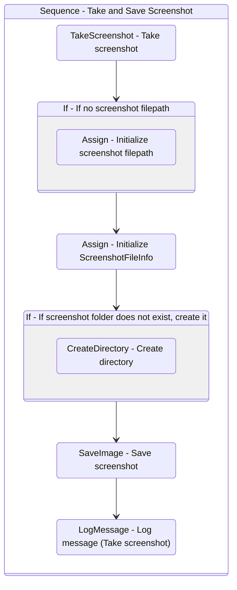

# TakeScreenshot
Class: TakeScreenshot

Capture a screenshot, log its name and location and save it with the PNG extension.
If no specific filepath is passed as argument, it saves the image in the folder specified by in_Folder.

## Workflow Details

    

    <b>Namespaces</b>
    

    
- System
- System.Collections.Generic
- System.Data
- System.IO
- System.Linq
- System.Linq.Expressions
- System.Runtime.Serialization
- System.Text
- UiPath.Core
- UiPath.Core.Activities
- System.Collections.ObjectModel

    

    <b>References</b>
    

- Microsoft.CSharp
- System.Private.CoreLib
- System
- System.Activities
- System.Core
- System.Data
- System.Linq
- System.Data.Common
- System.Private.CoreLib
- System.Runtime.Serialization
- System.ServiceModel
- System.ServiceModel.Activities
- System.ValueTuple
- System.Xaml
- System.Xml
- System.Xml.Linq
- UiPath.CV
- UiPath.Excel
- UiPath.Platform
- UiPath.System.Activities
- UiPath.System.Activities.Design
- UiPath.UiAutomation.Activities
- WindowsBase

    

    <b>Arguments</b>
    

| Name | Direction | Type | Description |
|  --- | --- | --- | ---  |
| in_Folder | InArgument | x:String | Path to the folder where the screenshot should be saved. |
| io_FilePath | InOutArgument | x:String | Optional argument that specifies the path and the name of the screenshot to be taken. |

    

    

    <b>Workflows Used</b>
    

    

    

    <b>Tests</b>
    

    

## Outline (Beta)

