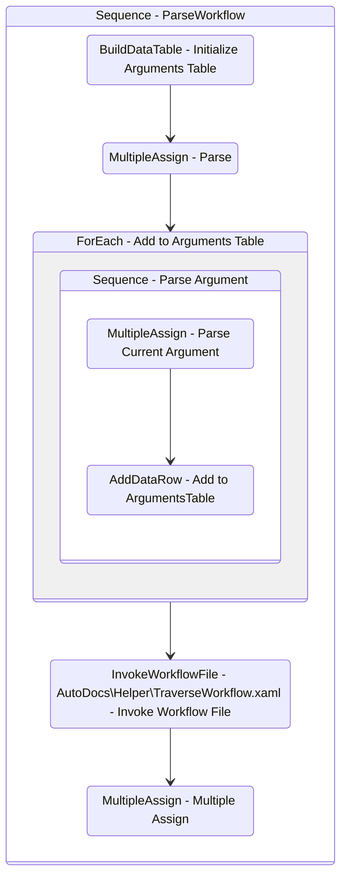

# ParseWorkflow
Class: ParseWorkflow

## Workflow Details

    

    <b>Namespaces</b>
    

    - System.Activities
- System.Activities.Statements
- System.Activities.Expressions
- System.Activities.Validation
- System.Activities.XamlIntegration
- Microsoft.VisualBasic
- Microsoft.VisualBasic.Activities
- System
- System.Collections
- System.Collections.Generic
- System.Collections.ObjectModel
- System.Data
- System.Diagnostics
- System.Linq
- System.Net.Mail
- System.Xml
- System.Text
- System.Xml.Linq
- UiPath.Core
- UiPath.Core.Activities
- System.Windows.Markup
- GlobalVariablesNamespace
- GlobalConstantsNamespace
- System.Reflection
- UiPath.Platform.ResourceHandling
- System.Xml.XPath
- System.IO
- Newtonsoft.Json.Linq
- System.Linq.Expressions
- System.Xml.Serialization
- System.ComponentModel
- System.Runtime.Serialization
- System.Runtime.CompilerServices
- Newtonsoft.Json
- System.Dynamic
- System.Collections.Specialized

    

    <b>References</b>
    

    - Microsoft.CSharp
- Microsoft.VisualBasic
- Newtonsoft.Json
- NPOI
- System
- System.Activities
- System.Collections.Immutable
- System.ComponentModel
- System.ComponentModel.TypeConverter
- System.Configuration.ConfigurationManager
- System.Console
- System.Core
- System.Data
- System.Data.Common
- System.IO.FileSystem.AccessControl
- System.IO.FileSystem.DriveInfo
- System.IO.FileSystem.Watcher
- System.IO.Packaging
- System.Linq
- System.Linq.Expressions
- System.Linq.Parallel
- System.Linq.Queryable
- System.Memory
- System.Memory.Data
- System.ObjectModel
- System.Private.CoreLib
- System.Private.DataContractSerialization
- System.Private.Uri
- System.Private.Xml
- System.Private.Xml.Linq
- System.Reflection.DispatchProxy
- System.Reflection.Metadata
- System.Reflection.TypeExtensions
- System.Runtime.Serialization
- System.Security.Permissions
- System.ServiceModel
- System.ServiceModel.Activities
- System.Xaml
- System.Xml
- System.Xml.Linq
- System.Xml.XPath.XDocument
- UiPath.Platform
- UiPath.Studio.Constants
- UiPath.System.Activities
- UiPath.Workflow
- System.Private.ServiceModel
- System.Collections
- netstandard
- System.ComponentModel.EventBasedAsync
- PresentationFramework
- WindowsBase
- Microsoft.Win32.Primitives
- System.ComponentModel.Primitives
- System.Runtime.Serialization.Formatters
- System.Runtime.Serialization.Primitives
- System.Data.SqlClient
- UiPath.System.Activities.Design
- UiPath.System.Activities.ViewModels
- System.Runtime.CompilerServices.VisualC
- System.Runtime.CompilerServices.Unsafe
- System.Runtime.InteropServices
- ℛ*6b3cf076-fd2c-4bf1-9bfb-4193a6a2d4b8#194-0
- ℛ*6b3cf076-fd2c-4bf1-9bfb-4193a6a2d4b8#207-0
- ℛ*6b3cf076-fd2c-4bf1-9bfb-4193a6a2d4b8#208-0
- ℛ*6b3cf076-fd2c-4bf1-9bfb-4193a6a2d4b8#210-0
- ℛ*6b3cf076-fd2c-4bf1-9bfb-4193a6a2d4b8#211-0
- ℛ*6b3cf076-fd2c-4bf1-9bfb-4193a6a2d4b8#218-0
- ℛ*6b3cf076-fd2c-4bf1-9bfb-4193a6a2d4b8#222-0
- ℛ*6b3cf076-fd2c-4bf1-9bfb-4193a6a2d4b8#223-0
- ℛ*6b3cf076-fd2c-4bf1-9bfb-4193a6a2d4b8#224-0
- ℛ*6b3cf076-fd2c-4bf1-9bfb-4193a6a2d4b8#225-0
- ℛ*6b3cf076-fd2c-4bf1-9bfb-4193a6a2d4b8#226-0
- ℛ*6b3cf076-fd2c-4bf1-9bfb-4193a6a2d4b8#227-0
- ℛ*6b3cf076-fd2c-4bf1-9bfb-4193a6a2d4b8#228-0
- ℛ*6b3cf076-fd2c-4bf1-9bfb-4193a6a2d4b8#233-0
- ℛ*6b3cf076-fd2c-4bf1-9bfb-4193a6a2d4b8#234-0
- ℛ*6b3cf076-fd2c-4bf1-9bfb-4193a6a2d4b8#236-0
- ℛ*6b3cf076-fd2c-4bf1-9bfb-4193a6a2d4b8#240-0
- ℛ*6b3cf076-fd2c-4bf1-9bfb-4193a6a2d4b8#241-0
- ℛ*6b3cf076-fd2c-4bf1-9bfb-4193a6a2d4b8#242-0
- ℛ*6b3cf076-fd2c-4bf1-9bfb-4193a6a2d4b8#243-0
- ℛ*6b3cf076-fd2c-4bf1-9bfb-4193a6a2d4b8#244-0
- ℛ*6b3cf076-fd2c-4bf1-9bfb-4193a6a2d4b8#245-0
- ℛ*6b3cf076-fd2c-4bf1-9bfb-4193a6a2d4b8#246-0
- ℛ*6b3cf076-fd2c-4bf1-9bfb-4193a6a2d4b8#253-0
- ℛ*6b3cf076-fd2c-4bf1-9bfb-4193a6a2d4b8#254-0
- ℛ*6b3cf076-fd2c-4bf1-9bfb-4193a6a2d4b8#255-0
- ℛ*6b3cf076-fd2c-4bf1-9bfb-4193a6a2d4b8#256-0
- ℛ*6b3cf076-fd2c-4bf1-9bfb-4193a6a2d4b8#276-0
- System.Collections.Specialized
- System.Collections.NonGeneric

    

    <b>Arguments</b>
    

    <table><tr><th>Name</th><th>Direction</th><th>Type</th><th>Description</th></tr><tr><td>in_FilePath</td><td>InArgument</td><td>x:String</td><td></td></tr><tr><td>out_Document</td><td>OutArgument</td><td>sxl:XDocument</td><td></td></tr><tr><td>out_Namespaces</td><td>OutArgument</td><td>scg:List(x:String)</td><td></td></tr><tr><td>out_References</td><td>OutArgument</td><td>scg:List(x:String)</td><td></td></tr><tr><td>out_DocumentClass</td><td>OutArgument</td><td>x:String</td><td></td></tr><tr><td>out_WorkflowName</td><td>OutArgument</td><td>x:String</td><td></td></tr><tr><td>out_WorkflowDescription</td><td>OutArgument</td><td>x:String</td><td></td></tr><tr><td>out_OutlineMarkdown</td><td>OutArgument</td><td>x:String</td><td></td></tr><tr><td>out_dt_Arguments</td><td>OutArgument</td><td>sd:DataTable</td><td></td></tr></table>
    

## Outline (Beta)

