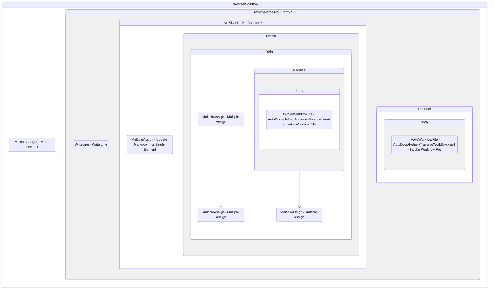

# {WorkflowName}
Class: TraverseWorkflow

## Workflow Details

    

    <b>Namespaces</b>
    

    - System.Activities
- System.Activities.Statements
- System.Activities.Expressions
- System.Activities.Validation
- System.Activities.XamlIntegration
- Microsoft.VisualBasic
- Microsoft.VisualBasic.Activities
- System
- System.Collections
- System.Collections.Generic
- System.Collections.ObjectModel
- System.Data
- System.Diagnostics
- System.Linq
- System.Net.Mail
- System.Xml
- System.Text
- System.Xml.Linq
- UiPath.Core
- UiPath.Core.Activities
- System.Windows.Markup
- GlobalVariablesNamespace
- GlobalConstantsNamespace
- System.Reflection
- System.Xml.Serialization
- System.IO
- Newtonsoft.Json.Linq
- Newtonsoft.Json
- System.Dynamic
- System.ComponentModel
- System.Collections.Specialized
- System.Linq.Expressions
- System.Runtime.Serialization

    

    <b>References</b>
    

    - Microsoft.CSharp
- System
- System.Linq
- System.Core
- System.Activities
- System.Data
- System.Data.Common
- System.Runtime.Serialization
- System.ServiceModel
- System.ServiceModel.Activities
- System.Xaml
- System.Activities
- Microsoft.VisualBasic
- System.Private.CoreLib
- System.Data
- System
- System.Core
- System.Xml
- System.Xml.Linq
- System.Xaml
- UiPath.System.Activities
- UiPath.UiAutomation.Activities
- UiPath.Studio.Constants
- System.Reflection.DispatchProxy
- System.Reflection.TypeExtensions
- System.ObjectModel
- System.Reflection.Metadata
- System.Private.Xml.Linq
- System.Private.Xml
- UiPath.Workflow
- System.Private.DataContractSerialization
- System.Linq.Expressions
- System.Linq.Parallel
- System.Collections.Immutable
- System.Linq.Queryable
- NPOI
- System.Memory.Data
- System.ComponentModel.TypeConverter
- System.Console
- System.Configuration.ConfigurationManager
- System.Security.Permissions
- System.ComponentModel
- System.Memory
- System.Private.Uri
- System.IO.FileSystem.Watcher
- System.IO.Packaging
- System.IO.FileSystem.AccessControl
- System.IO.FileSystem.DriveInfo
- System.Private.ServiceModel
- System.Collections
- netstandard
- Newtonsoft.Json
- System.ComponentModel.EventBasedAsync
- PresentationFramework
- WindowsBase
- Microsoft.Win32.Primitives
- System.ComponentModel.Primitives
- System.Collections.Specialized
- System.Collections.NonGeneric
- System.Runtime.Serialization.Formatters
- System.Runtime.Serialization.Primitives
- UiPath.System.Activities.Design
- UiPath.System.Activities.ViewModels

    

    <b>Arguments</b>
    

    <table><tr><th>Name</th><th>Direction</th><th>Type</th><th>Description</th></tr><tr><td>in_XElement</td><td>InArgument</td><td>sxl:XElement</td><td></td></tr><tr><td>io_Markdown</td><td>InOutArgument</td><td>x:String</td><td></td></tr><tr><td>io_PreviousActivity</td><td>InOutArgument</td><td>x:String</td><td></td></tr></table>

## Outline (Beta)

