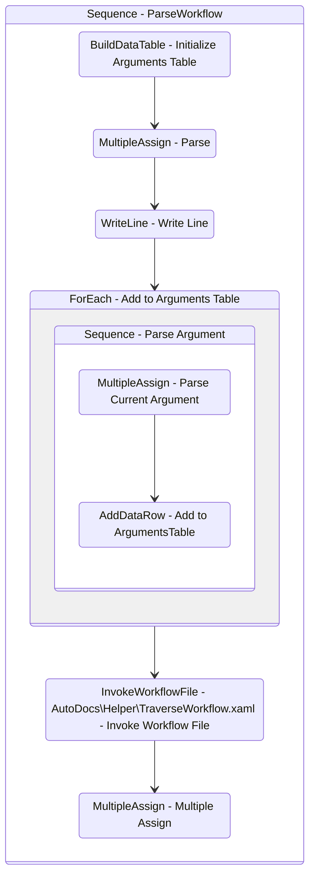

# ParseWorkflow
Class: ParseWorkflow

## Workflow Details

    

    <b>Namespaces</b>
    

    
- System.Activities
- System.Activities.Statements
- System.Activities.Expressions
- System.Activities.Validation
- System.Activities.XamlIntegration
- Microsoft.VisualBasic
- Microsoft.VisualBasic.Activities
- System
- System.Collections
- System.Collections.Generic
- System.Collections.ObjectModel
- System.Data
- System.Diagnostics
- System.Linq
- System.Net.Mail
- System.Xml
- System.Text
- System.Xml.Linq
- UiPath.Core
- UiPath.Core.Activities
- System.Windows.Markup
- GlobalVariablesNamespace
- GlobalConstantsNamespace
- System.Reflection
- UiPath.Platform.ResourceHandling
- System.Xml.XPath
- System.IO
- Newtonsoft.Json.Linq
- System.Linq.Expressions
- System.Xml.Serialization
- System.ComponentModel
- System.Runtime.Serialization
- System.Runtime.CompilerServices
- Newtonsoft.Json
- System.Dynamic
- System.Collections.Specialized

    

    <b>References</b>
    

- Microsoft.CSharp
- Microsoft.VisualBasic
- Microsoft.Win32.Primitives
- netstandard
- Newtonsoft.Json
- NPOI
- PresentationFramework
- System
- System.Activities
- System.Collections
- System.Collections.Immutable
- System.Collections.NonGeneric
- System.Collections.Specialized
- System.ComponentModel
- System.ComponentModel.EventBasedAsync
- System.ComponentModel.Primitives
- System.ComponentModel.TypeConverter
- System.Configuration.ConfigurationManager
- System.Console
- System.Core
- System.Data
- System.Data.Common
- System.Data.SqlClient
- System.IO.FileSystem.AccessControl
- System.IO.FileSystem.DriveInfo
- System.IO.FileSystem.Watcher
- System.IO.Packaging
- System.Linq
- System.Linq.Expressions
- System.Linq.Parallel
- System.Linq.Queryable
- System.Memory
- System.Memory.Data
- System.ObjectModel
- System.Private.CoreLib
- System.Private.DataContractSerialization
- System.Private.ServiceModel
- System.Private.Uri
- System.Private.Xml
- System.Private.Xml.Linq
- System.Reflection.DispatchProxy
- System.Reflection.Metadata
- System.Reflection.TypeExtensions
- System.Runtime.CompilerServices.Unsafe
- System.Runtime.CompilerServices.VisualC
- System.Runtime.InteropServices
- System.Runtime.Serialization
- System.Runtime.Serialization.Formatters
- System.Runtime.Serialization.Primitives
- System.Security.Permissions
- System.ServiceModel
- System.ServiceModel.Activities
- System.Xaml
- System.Xml
- System.Xml.Linq
- System.Xml.XPath.XDocument
- UiPath.Platform
- UiPath.Studio.Constants
- UiPath.System.Activities
- UiPath.System.Activities.Design
- UiPath.System.Activities.ViewModels
- UiPath.Workflow
- WindowsBase

    

    <b>Arguments</b>
    

| Name | Direction | Type | Description |
|  --- | --- | --- | ---  |
| in_FilePath | InArgument | x:String |  |
| out_Document | OutArgument | sxl:XDocument |  |
| out_Namespaces | OutArgument | scg:List(x:String) |  |
| out_References | OutArgument | scg:List(x:String) |  |
| out_DocumentClass | OutArgument | x:String |  |
| out_WorkflowName | OutArgument | x:String |  |
| out_WorkflowDescription | OutArgument | x:String |  |
| out_OutlineMarkdown | OutArgument | x:String |  |
| out_dt_Arguments | OutArgument | sd:DataTable |  |
| out_WorkflowsUsed | OutArgument | scg:IEnumerable(x:String) |  |

    

    

    <b>Workflows Used</b>
    

- C:\Users\eyash\Documents\UiPath\LazyFramework\AutoDocs\TraverseWorkflow.xaml

    

    

    <b>Tests</b>
    

    

## Outline (Beta)

