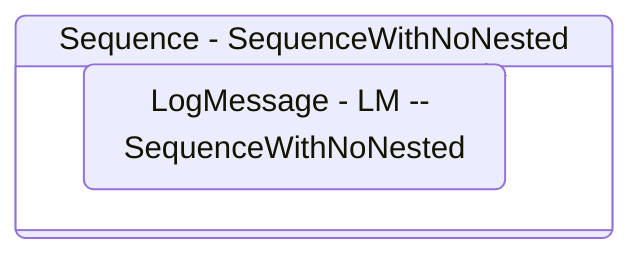

# SequenceWithNoNested
Class: SequenceWithNoNested

A sequence with no nested sequences or other items within it.

## Workflow Details

    

    <b>Namespaces</b>
    

    - System.Activities
- System.Activities.Statements
- System.Activities.Expressions
- System.Activities.Validation
- System.Activities.XamlIntegration
- Microsoft.VisualBasic
- Microsoft.VisualBasic.Activities
- System
- System.Collections
- System.Collections.Generic
- System.Collections.ObjectModel
- System.Data
- System.Diagnostics
- System.Linq
- System.Net.Mail
- System.Xml
- System.Text
- System.Xml.Linq
- UiPath.Core
- UiPath.Core.Activities
- System.Windows.Markup
- GlobalVariablesNamespace
- GlobalConstantsNamespace

    

    <b>References</b>
    

    - Microsoft.CSharp
- System
- System.Linq
- System.Core
- System.Activities
- System.Data
- System.Data.Common
- System.Runtime.Serialization
- System.ServiceModel
- System.ServiceModel.Activities
- System.Xaml
- System.Activities
- Microsoft.VisualBasic
- System.Private.CoreLib
- System.Data
- System
- System.Core
- System.Xml
- System.Xml.Linq
- System.Xaml
- UiPath.System.Activities
- UiPath.UiAutomation.Activities
- UiPath.Studio.Constants
- NPOI
- System.Memory.Data
- System.ComponentModel.TypeConverter
- System.Console
- System.Configuration.ConfigurationManager
- System.Security.Permissions
- System.ComponentModel
- System.Memory
- System.Private.Uri

    

    <b>Arguments</b>
    

    <table><tr><th>Name</th><th>Direction</th><th>Type</th><th>Description</th></tr></table>
    

## Outline (Beta)

