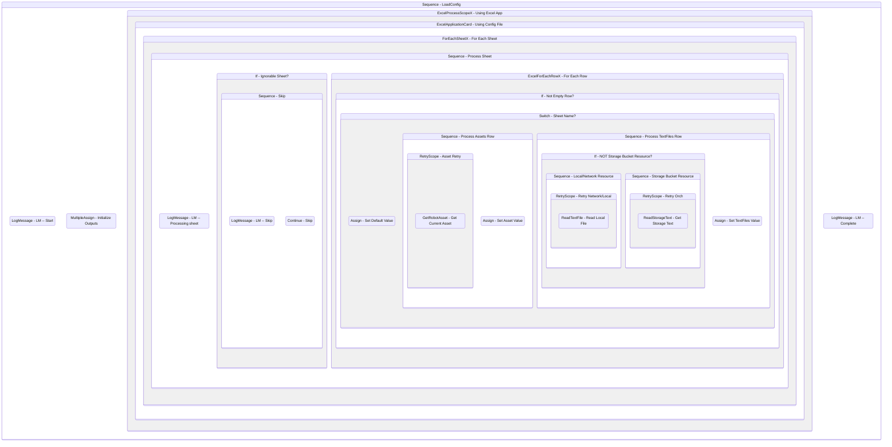

# LoadConfig
Class: LoadConfig

Reads the config file, ignoring the sheets defined, and outputs the config and textfiles arguments.

## Workflow Details

    

    <b>Namespaces</b>
    

    
- GlobalConstantsNamespace
- GlobalVariablesNamespace
- Microsoft.VisualBasic
- Microsoft.VisualBasic.Activities
- System
- System.Activities
- System.Activities.Expressions
- System.Activities.Statements
- System.Activities.Validation
- System.Activities.XamlIntegration
- System.Collections
- System.Collections.Generic
- System.Collections.ObjectModel
- System.Data
- System.Diagnostics
- System.Linq
- System.Net.Mail
- System.Reflection
- System.Runtime.Serialization
- System.Text
- System.Windows.Markup
- System.Xml
- System.Xml.Linq
- UiPath.Core
- UiPath.Core.Activities
- UiPath.Core.Activities.Orchestrator
- UiPath.Core.Activities.Storage
- UiPath.Excel
- UiPath.Excel.Activities.Business
- UiPath.Excel.Model
- UiPath.Platform.ResourceHandling
- UiPath.Shared.Activities.Business

    

    <b>References</b>
    

- Microsoft.CSharp
- Microsoft.VisualBasic
- NPOI
- System
- System.Activities
- System.Collections
- System.Collections.Immutable
- System.ComponentModel
- System.ComponentModel.TypeConverter
- System.Configuration.ConfigurationManager
- System.Console
- System.Core
- System.Data
- System.Data.Common
- System.Linq
- System.Linq.Expressions
- System.Linq.Parallel
- System.Linq.Queryable
- System.Memory
- System.Memory.Data
- System.ObjectModel
- System.Private.CoreLib
- System.Private.DataContractSerialization
- System.Private.ServiceModel
- System.Private.Uri
- System.Reflection.DispatchProxy
- System.Reflection.Metadata
- System.Reflection.TypeExtensions
- System.Runtime.Serialization
- System.Runtime.Serialization.Formatters
- System.Runtime.Serialization.Primitives
- System.Security.Permissions
- System.ServiceModel
- System.ServiceModel.Activities
- System.Xaml
- System.Xml
- System.Xml.Linq
- UiPath.Excel
- UiPath.Excel.Activities
- UiPath.Excel.Activities.Design
- UiPath.Mail.Activities
- UiPath.Platform
- UiPath.Studio.Constants
- UiPath.System.Activities
- UiPath.System.Activities.Design
- UiPath.System.Activities.ViewModels
- UiPath.Testing.Activities
- UiPath.Workflow

    

    <b>Arguments</b>
    

| Name | Direction | Type | Description |
|  --- | --- | --- | ---  |
| in_ConfigPath | InArgument | x:String | The path to the config file to read. |
| in_IgnoreSheets | InArgument | s:String[] | An array of sheet names to ignore loading into the config variable. |
| out_Config | OutArgument | scg:Dictionary(x:String, x:String) | The loaded config dictionary. |
| out_TextFiles | OutArgument | scg:Dictionary(x:String, x:String) | The loaded dictionary of text resources. |

    

    

    <b>Workflows Used</b>
    

    

    

    <b>Tests</b>
    

- C:\Users\eyash\Documents\UiPath\LazyFramework\Tests\Utility\LoadConfig\LoadConfigSuccess.xaml

    

## Outline (Beta)

