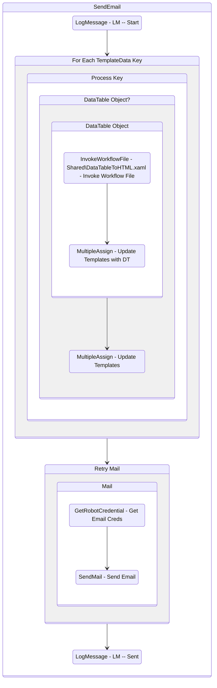

# SendEmail
Class: SendEmail

Sends an email taking a dictionary of data to fill out template subject and body fields. Supports DataTable to HTML <table> objects as well.

## Workflow Details

    

    <b>Namespaces</b>
    

    - GlobalConstantsNamespace
- GlobalVariablesNamespace
- Microsoft.VisualBasic
- Microsoft.VisualBasic.Activities
- System
- System.Activities
- System.Activities.Expressions
- System.Activities.Statements
- System.Activities.Validation
- System.Activities.XamlIntegration
- System.Collections
- System.Collections.Generic
- System.Collections.ObjectModel
- System.ComponentModel
- System.Data
- System.Diagnostics
- System.Linq
- System.Linq.Expressions
- System.Net.Mail
- System.Reflection
- System.Runtime.Serialization
- System.Security
- System.Text
- System.Windows.Markup
- System.Xml
- System.Xml.Linq
- System.Xml.Serialization
- UiPath.Core
- UiPath.Core.Activities
- UiPath.Mail
- UiPath.Mail.Activities
- UiPath.Mail.SMTP.Activities
- UiPath.Shared.Activities

    

    <b>References</b>
    

    - Microsoft.CSharp
- Microsoft.VisualBasic
- Microsoft.Win32.Primitives
- NPOI
- PresentationFramework
- System
- System.Activities
- System.Collections
- System.ComponentModel
- System.ComponentModel.EventBasedAsync
- System.ComponentModel.Primitives
- System.ComponentModel.TypeConverter
- System.Configuration.ConfigurationManager
- System.Console
- System.Core
- System.Data
- System.Data.Common
- System.Data.SqlClient
- System.Linq
- System.Linq.Expressions
- System.Memory
- System.Memory.Data
- System.Net.Mail
- System.ObjectModel
- System.Private.CoreLib
- System.Private.DataContractSerialization
- System.Private.ServiceModel
- System.Private.Uri
- System.Private.Xml
- System.Reflection.DispatchProxy
- System.Reflection.Metadata
- System.Reflection.TypeExtensions
- System.Runtime.InteropServices
- System.Runtime.Serialization
- System.Runtime.Serialization.Formatters
- System.Runtime.Serialization.Primitives
- System.Security.Permissions
- System.ServiceModel
- System.ServiceModel.Activities
- System.Xaml
- System.Xml
- System.Xml.Linq
- UiPath.Excel.Activities
- UiPath.Mail
- UiPath.Mail.Activities
- UiPath.Mail.Activities.Design
- UiPath.Studio.Constants
- UiPath.System.Activities
- UiPath.System.Activities.Design
- UiPath.System.Activities.ViewModels
- UiPath.Testing.Activities
- UiPath.Workflow
- WindowsBase

    

    <b>Arguments</b>
    

    <table><tr><th>Name</th><th>Direction</th><th>Type</th><th>Description</th></tr><tr><td>in_To</td><td>InArgument</td><td>x:String</td><td>Who to send the email to.</td></tr><tr><td>in_Subject</td><td>InArgument</td><td>x:String</td><td>The templated subject of the email to send.</td></tr><tr><td>in_Body</td><td>InArgument</td><td>x:String</td><td>The templated body of the email to send in HTML format.</td></tr><tr><td>in_Attachments</td><td>InArgument</td><td>scg:IEnumerable<x:String></td><td>An array of file paths to include as attachments in the email.</td></tr><tr><td>in_Port</td><td>InArgument</td><td>x:Int32</td><td>The SMTP port to use when sending emails.</td></tr><tr><td>in_Server</td><td>InArgument</td><td>x:String</td><td>The SMTP server to use for sending emails.</td></tr><tr><td>in_CredentialFolder</td><td>InArgument</td><td>x:String</td><td>The name of the Orchestrator folder that holds the credential asset for authenticating to the SMTP server.</td></tr><tr><td>in_CredentialName</td><td>InArgument</td><td>x:String</td><td>The name of the credential asset for authenticating to the SMTP server.</td></tr><tr><td>in_CC</td><td>InArgument</td><td>x:String</td><td>Who to CC on the email.</td></tr><tr><td>in_TemplateData</td><td>InArgument</td><td>scg:Dictionary<x:String, x:Object></td><td>A dictionary of variables to replace in the template. Keys must match the value in the template.</td></tr></table>
    

## Outline (Beta)

