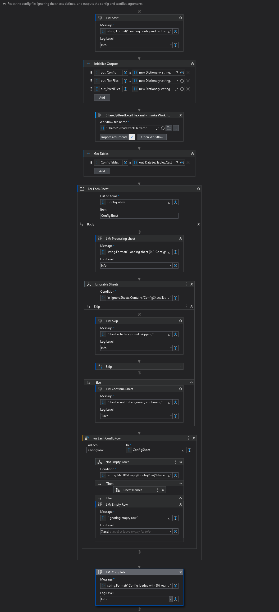

# Introduction

## Design Philosophy

The design philosophy behind migrating a UiPath framework to a coded implementation focuses on improving maintainability, scalability, and performance. By using code, developers can leverage advanced programming concepts, better version control, and integration with other development tools.

### Key Benefits
- **Readability**: Outside of a few use cases, XAML files are typically less readable than their equivalent counter-part. I mean a few things by this:
  - Larger Context Window: I think of the code that I can see on a single screen much like how you would view 'context windows' for AIs. Yes, there are methods to compensate for smaller context windows, but output is most significantly increased by increasing the context window that can be processed at a time. Consider the below examples of the same workflow in Coded and Xaml format.
  | Xaml | Coded |
  |-----|------|
  |a | b|

  Xaml:
  
  Coded:

- **Scalability**: Ensure the framework can handle increasing complexity and volume of tasks.
- **Maintainability**: Simplify updates and debugging by using standard coding practices.